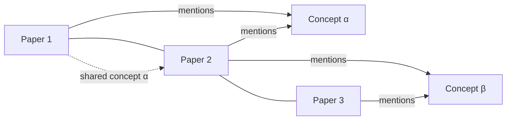

# Research Paper Synthesizer

A FastAPI + React application that ingests a folder of research paper PDFs, builds a semantic knowledge graph (papers + concept nodes), indexes text chunks with embeddings, and answers comparative questions using Retrieval-Augmented Generation plus graph traversal. Optionally enhances synthesis via Groq LLM when `GROQ_API_KEY` is set.

## Features
- Upload multiple PDFs and automatic text extraction + chunking.
- Embedding index (SentenceTransformers + FAISS) for semantic retrieval.
- Keyphrase extraction (YAKE) to create concept nodes and connect papers.
- Graph relations: paper–concept (mentions), paper–paper (shared concepts).
- RAG Query endpoint returns answer, supporting chunks, traversal path, and subgraph.
- Optional Groq LLM synthesis using environment API key.
- React UI: upload, query chat, force-directed graph visualization.

## Architecture Overview

```mermaid
graph TD
    A[Upload PDFs] --> B[PDF Loader: extract + chunk]
    B --> C[Embeddings Index]
    B --> D[Keyphrase Extractor]
    D --> E[Knowledge Graph]
    C --> F[Query Engine]
    E --> F
    F --> G[LLM Synthesis (optional Grok)]
    G --> H[Answer + Sources + Subgraph]
```

### Knowledge Graph Construction


### Query Flow
1. Receive user question.
2. Vector retrieval of top-k chunks.
3. Determine ordered paper list from chunks.
4. Greedy graph traversal connecting papers through shared concepts.
5. Construct prompt (sources + path + question).
6. Call Grok LLM if configured; else heuristic summary.
7. Return answer + sources + traversal path + subgraph.

## Backend Endpoints
- `POST /upload-pdfs` multipart file list
- `POST /build-graph` build / rebuild graph
- `GET /graph` full graph JSON
- `GET /papers` paper metadata
- `POST /query` JSON `{question, k}` returns synthesis

## Environment Variables
Create `.env` (copy `.env.example`):
```
GROQ_API_KEY=sk-your-groq-key
# Optional: choose a supported model, else auto-pick is used by the checker
# GROQ_MODEL=llama-3.1-70b-versatile
# GROQ_MODEL=llama-3.1-8b-instant
EMBED_MODEL=sentence-transformers/all-MiniLM-L6-v2
```

## Running Locally
### Backend
```powershell
cd paper-synthesizer/backend
python -m venv .venv
.venv\Scripts\activate
pip install -r requirements.txt
uvicorn app.main:app --reload
```

### Frontend
```powershell
cd paper-synthesizer/frontend
npm install
npm run dev
```
Visit: http://localhost:5173

## Testing (Backend)
Basic tests (to be expanded) will validate ingestion and query.
```powershell
pytest
```

## Future Improvements
- More robust concept typing (methods, datasets, results) via NER / taxonomy.
- Add summarization caching.
- Persist graph in a graph database (Neo4j) for scalability.
- Incremental graph updates on new uploads without full rebuild.
- Enhanced traversal algorithms (community detection, path scoring).
- Streaming LLM responses via Groq API.

## License
MIT (adjust as needed).
